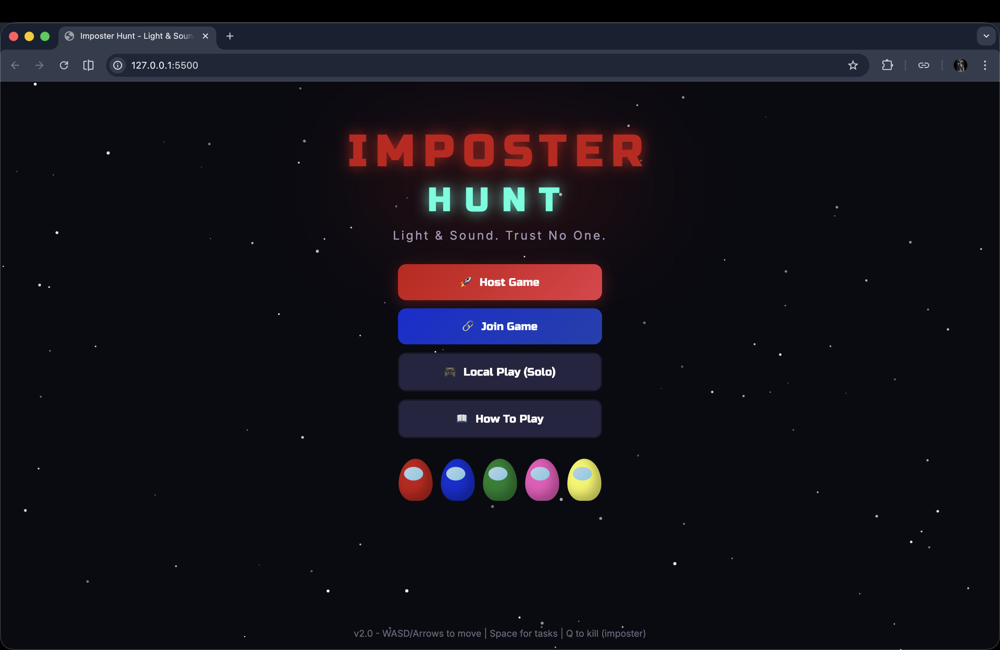
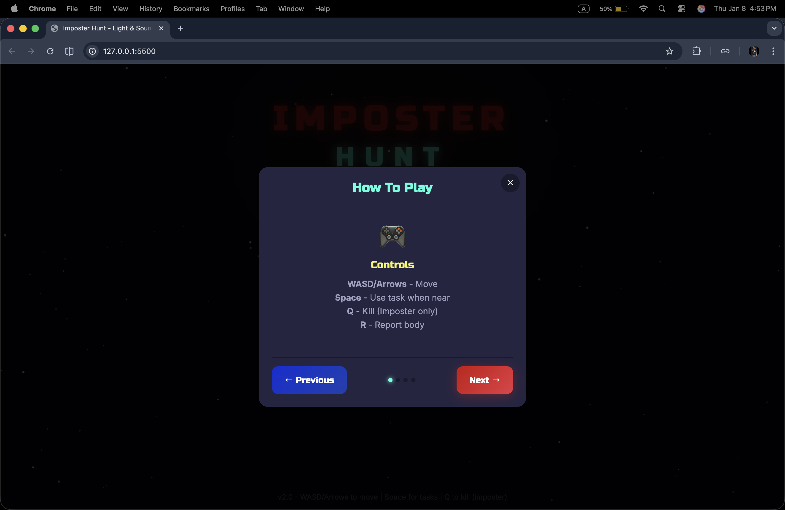
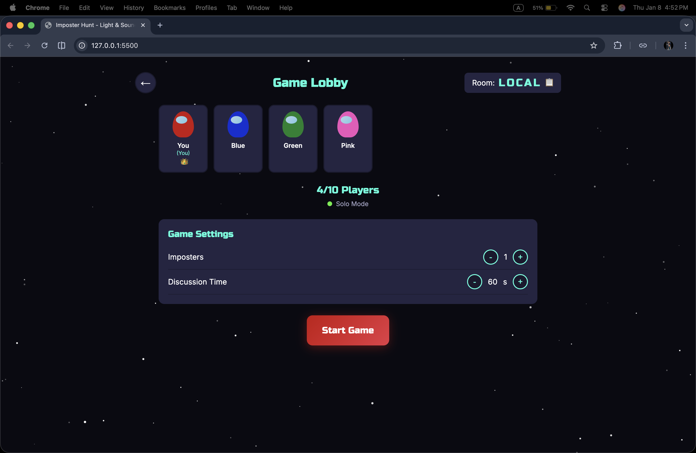
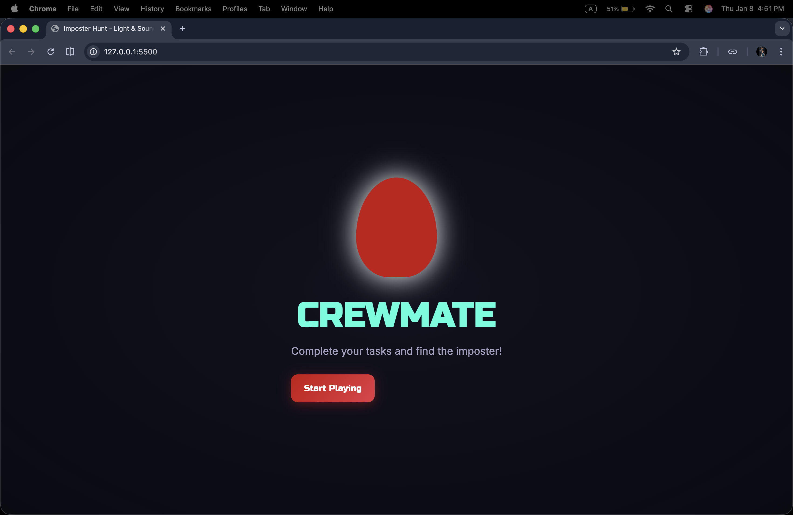
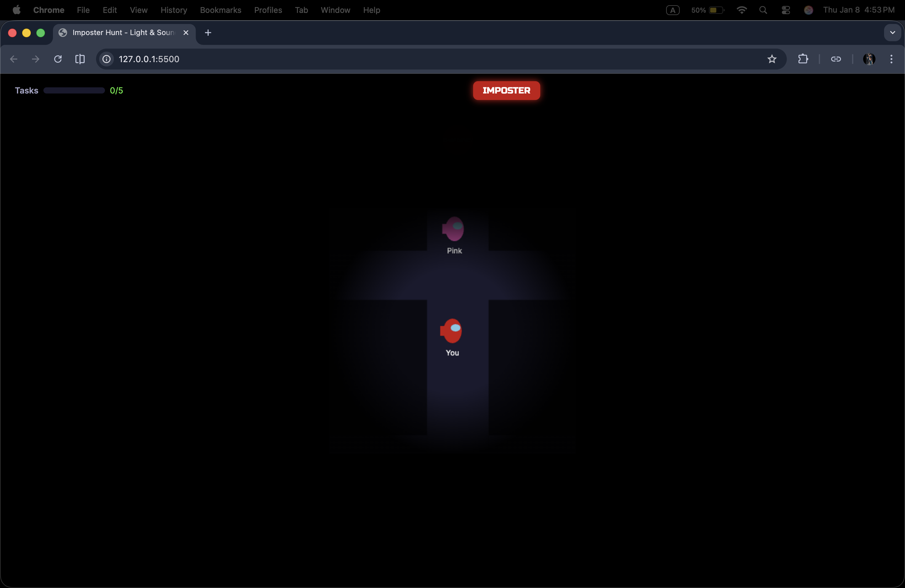
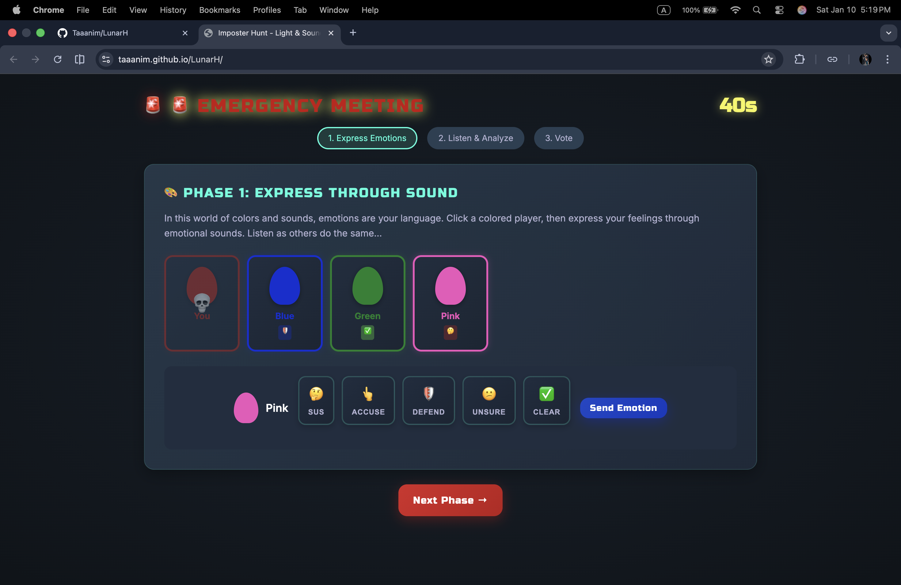
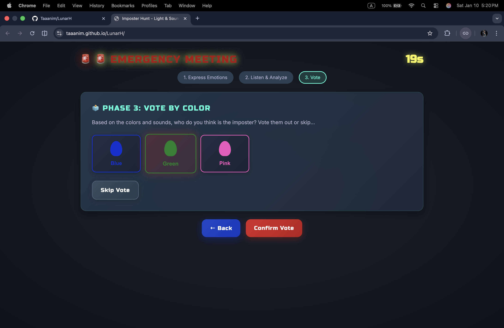
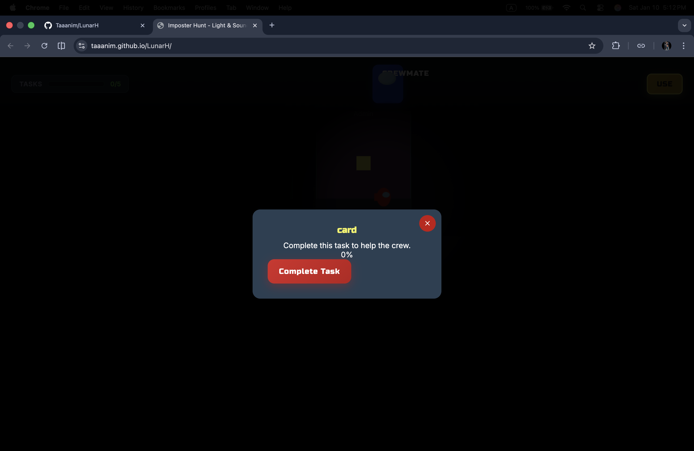
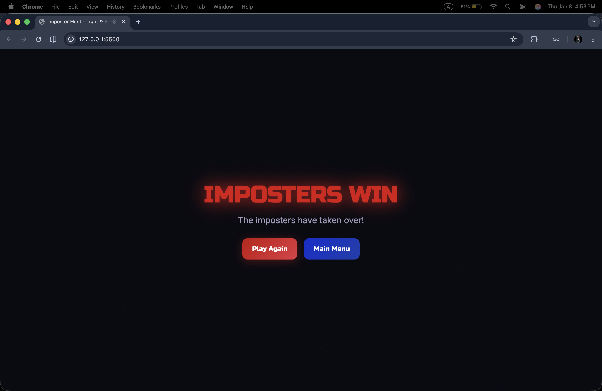

# Imposter Hunt

A wordless multiplayer game where emotion replaces language. Players communicate only through color, light, shape, sound, and music to sense trust, suspicion, and intent.

Inspired by Among Us, the game explores how meaning and decision-making emerge without words. A new emotional language is formed between light and sound.

**Theme**: *"In a world made only of colors and sounds, how would emotions speak?"*

## Live Demo

Play now: [https://taaanim.github.io/LunarH/](https://taaanim.github.io/LunarH/)

---

## Screenshots

| Main Menu | How to Play | Game Lobby |
|:---------:|:-----------:|:----------:|
|  |  |  |

| Role Assignment | Gameplay Map | Emergency Meeting |
|:---------------:|:------------:|:-----------------:|
|  |  |  |

| Voting Phase | Task Completion | Game Over |
|:------------:|:---------------:|:---------:|
|  |  |  |

---

## Core Concept

| Element | Meaning |
|---------|---------|
| **Color** | Your identity (Red, Blue, Green, Pink, Yellow, Orange) |
| **Sound** | Your communication (5 emotional sounds) |
| **Pattern** | The truth (layered sounds reveal guilt/innocence) |

### Emotion System

| Suspicious | Accusing | Defending | Confused | Innocent |
|:----------:|:--------:|:---------:|:--------:|:--------:|
| Uncertain tone | Pointing sound | Shield tone | Questioning | Clear bell |

---

## How to Play

### Controls

| Key | Action |
|-----|--------|
| WASD / Arrows | Move |
| Space | Use task / Emergency |
| Q | Kill (Imposter only) |
| R | Report body |

### Meeting Phases

1. **Express** - Click player, choose emotion, send
2. **Listen** - Click players to hear their emotional symphony
3. **Vote** - Eject suspect or skip

---

## Quick Start

**Solo Mode**: Click "Local Play" to practice vs AI bots

**Multiplayer**:
- Host: "Host Game" → Share code
- Join: "Join Game" → Enter code
- 2-10 players, no server needed (P2P)

---

## Win Conditions

- **Crewmates**: Eject all imposters OR complete all tasks
- **Imposters**: Equal or outnumber crewmates

---

## Tech Stack

- Pure HTML/CSS/JavaScript
- PeerJS (WebRTC P2P)
- Web Audio API
- GitHub Pages compatible

---

## Project Structure

```
LunarH/
├── index.html          # Main HTML file
├── styles.css          # Primary stylesheet
├── theme-modern.css    # Alternative modern theme
├── game.js             # Core game logic
├── audio.js            # Sound system and emotions
├── multiplayer.js      # P2P networking with PeerJS
├── screenshots/        # Game screenshots (01-12.png)
├── docs/               # Developer documentation
│   ├── LISTEN_PHASE_FIX.md
│   ├── MAP_LAYOUT.md
│   └── MODERN_THEME_GUIDE.md
└── README.md
```

---

## Contributing

This project was built for a hackathon. Contributions, bug fixes, and feature suggestions are welcome.

---

## License

MIT License

---

*Colors Speak | Sounds Reveal | Patterns Win*
